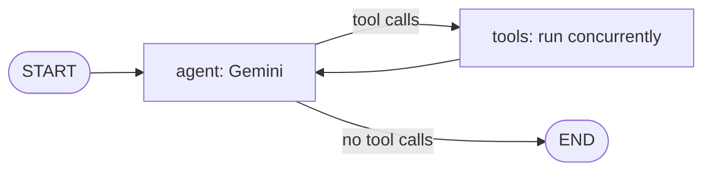

# Luca Agent Core

A FastAPI backend that runs a LangGraph agent on Gemini and streams its output over SSE. Tools are auto-discovered from `app/tools/` and enabled per request; with none requested, the agent just converses.

## Status

**Active prototype.** The core loop works end to end, but it is not production-hardened. Planned work is tracked in the issues:

| Area | Issue | Status |
|------|-------|--------|
| Safe expression evaluation in `calculate_metric` | [#4](../../issues/4) | Planned |
| Per-session isolation (no shared default `thread_id`) | [#5](../../issues/5) | Planned |
| Configurable CORS origins | [#6](../../issues/6) | Planned |
| Config validation, `.env.example`, cleanup | [#7](../../issues/7) | Planned |

**Limitations:** history is in memory (lost on restart); `get_weather_forecast` is a stub returning a fixed value; only Gemini is wired up; `/stream` has no authentication.

## How it works



- **Opt-in tools:** `POST /stream` binds only the tools named in `tools`. Unknown names return HTTP 400.
- **Resilient execution:** tool calls run concurrently; exceptions become error messages for the model instead of breaking the stream.
- **Auto-discovery:** every module in `app/tools/` is imported at startup and its tools registered.

## Quickstart

Requires [uv](https://astral.sh/uv/) and a Google AI API key. The app will not start without `GOOGLE_API_KEY`.

```bash
git clone https://github.com/uaaoe/luca-agent-core.git
cd luca-agent-core
echo "GOOGLE_API_KEY=your-key" > .env
uv sync
uv run uvicorn app.main:app --reload --port 8000
```

Interactive docs: `http://localhost:8000/docs`. Python 3.11+ (3.12 pinned in `.python-version`).

## API

| Endpoint | Description |
|----------|-------------|
| `GET /health` | Status check |
| `GET /tools` | Registered tools with descriptions and JSON parameter schemas |
| `POST /stream` | SSE stream. Body: `message`, optional `tools` (list of names), optional `thread_id` |

`thread_id` keys conversation history. If omitted it currently defaults to a shared value ([#5](../../issues/5)), so send your own.

```bash
curl -N -X POST http://localhost:8000/stream \
  -H "Content-Type: application/json" \
  -d '{"message": "Weather in Barcelona?", "tools": ["get_weather_forecast"], "thread_id": "demo"}'
```

```text
data: {"type": "tool_call", "tool": "get_weather_forecast", "args": {"city": "Barcelona"}}

data: {"type": "tool_result", "tool": "get_weather_forecast", "output": "The weather in Barcelona is 26°C, mostly sunny."}

data: {"type": "message", "content": "It's 26°C and mostly sunny in Barcelona."}

data: [DONE]
```

## Adding a tool

Drop a file in `app/tools/`; no other changes are needed:

```python
from langchain_core.tools import tool
from app.tools.registry import registry

@registry.register
@tool
def get_crypto_price(symbol: str) -> str:
    """Fetch the latest spot price for a cryptocurrency symbol."""
    return f"Current price of {symbol.upper()}: $65,000 USD"
```

## Docker

```bash
docker build -t luca-agent-core .
docker run -p 8000:8000 --env-file .env luca-agent-core
```

Slim single-stage image listening on port 8000. Set `GOOGLE_API_KEY` in the environment.

## Development

- `uv run python smoke_test.py` runs a live end-to-end check (needs a valid key and network access to Gemini).
- Changes are specified first with [OpenSpec](https://github.com/Fission-AI/OpenSpec): current specs live in `openspec/specs/`, finished changes in `openspec/changes/archive/`. `.agents/` holds the workflow definitions for AI coding assistants.

## License

MIT. See [LICENSE](LICENSE).
